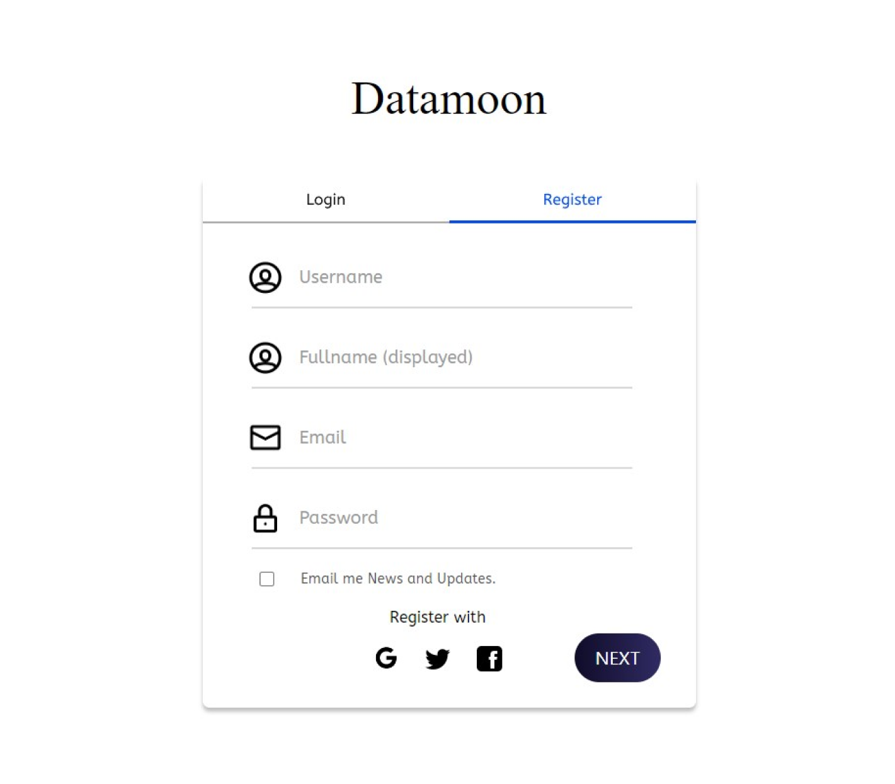
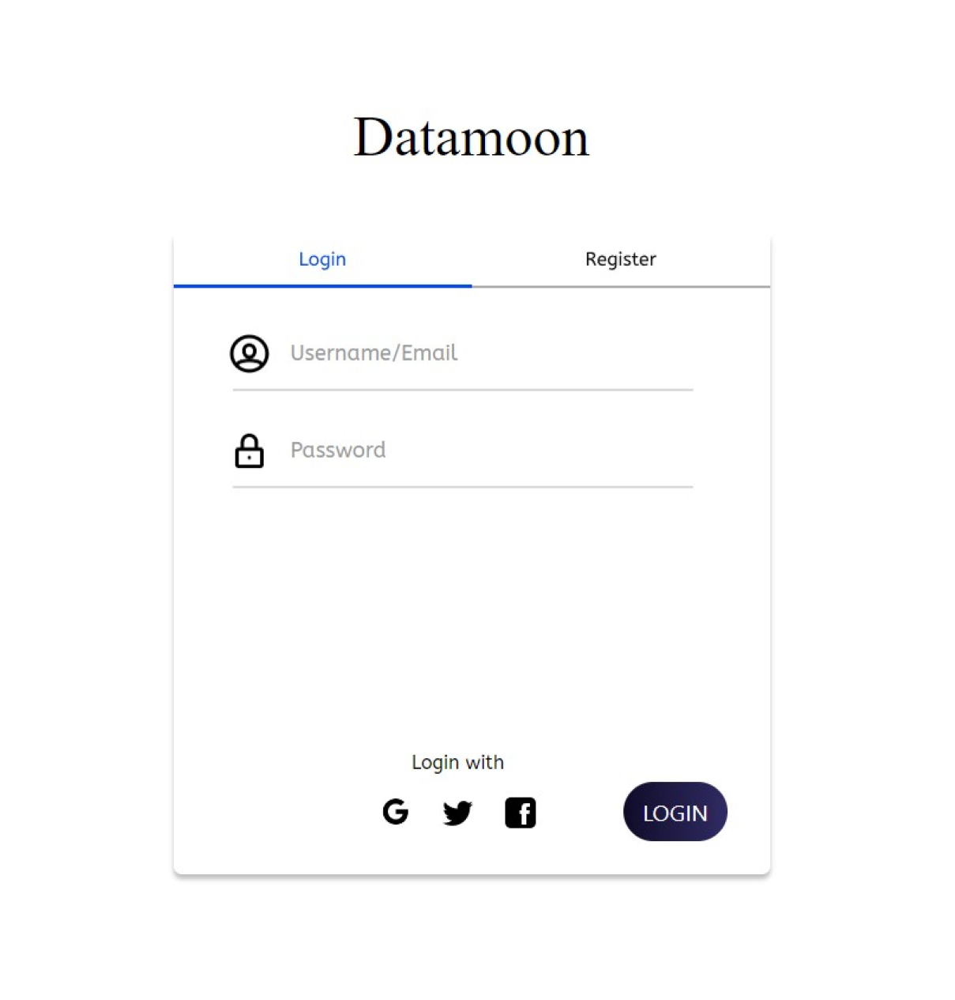

# Project Login-Register Datamoon
_Created by Rachmat Ghaly_

Datamoon is a platform for finding the Datasets and processing them to become the benefit of businesses, companies, and science. In this project, I designed all of the necessary pages and research all the things with my team to fill the content of the website

I have made the UI/UX Design using Figma
and now i'm learning how to make it to a Web App. So, The Feature will be made like this:

## Register

## Login

